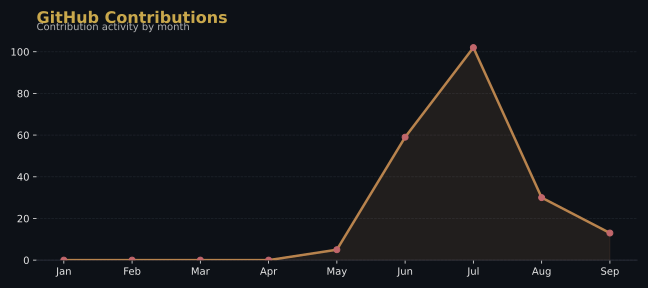

---

### 🧑‍💻 About Me

- 🌱 Sharpening my **Data Structures & Algorithms**, one problem a day
- 💻 Building full-stack apps with **React, HTML, CSS, JavaScript**
- 🗄️ Comfortable with **MongoDB** and **MySQL** on the backend
- ☕ Core language: **Java**
- 🎯 2026 goal: ship a full-stack project end-to-end, from schema to deploy
- 📫 Reach me at **rrsanthoshkumar06@gmail.com**

 

---

### 🛠️ Tech Stack

**Languages & DSA**

**Frontend**

**Backend & Databases**

---

### 🚀 Featured Projects

| Project | Description | Stack |
|---|---|---|
| **[Project Name](https://github.com/SanthoshKumar-572/REPLACE-WITH-REPO)** | One-line description of what it does and why it's interesting | React · Node · MongoDB |
| **[Project Name](https://github.com/SanthoshKumar-572/REPLACE-WITH-REPO)** | One-line description | Java · MySQL |
| **[Project Name](https://github.com/SanthoshKumar-572/REPLACE-WITH-REPO)** | One-line description | HTML · CSS · JS |

---

### 📊 GitHub Stats

📈 Chart auto-updates daily via <a href="./.github/workflows/update-chart.yml">GitHub Actions</a>

---

### 🏆 LeetCode Progress

---

### 🏅 GitHub Trophies

---

### Thanks for visiting! ⭐ Feel free to connect.

